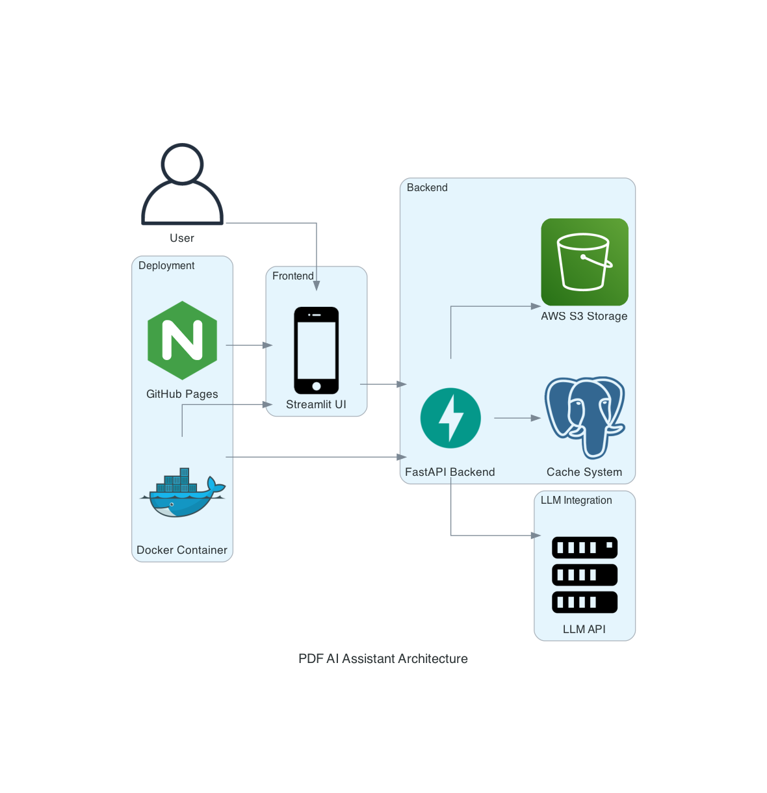

# AIAssistantForPDFs

## Project Summary
The **PDF AI Assistant** enhances document interaction by allowing users to upload, summarize, and ask questions about PDFs using Large Language Models (LLMs). This system is built with FastAPI for backend processing, Streamlit for the user interface, LiteLLM for efficient API interactions, and Redis for caching. The entire application is deployed using Docker Compose for seamless cloud deployment.

**Codelab**: https://asavari24.github.io/BigDataAssignment4Part1/#0

## Overview
The system follows a structured approach:

1. **Document Selection** → Users can choose previously parsed PDFs or upload new ones.
2. **Text Processing** → Extracts and structures PDF content for analysis.
3. **Summarization & Q&A** → Leverages LLMs to summarize content and answer queries.
4. **Model Pricing & Usage** → Calculates token usage and cost estimation per model.
5. **Deployment & Integration** → Uses Docker for deployment and integrates Redis for caching and S3 for storage.

## Key Features

### Document Selection & Processing
- Users can select from previously parsed PDFs or upload new ones.
- Uploaded PDFs are processed, and extracted text is stored for further interactions.

### LLM-Powered Summarization & Question Answering
- Supports multiple LLM models: 
  - GPT-4o (OpenAI)
  - Gemini-Flash (Google)
  - DeepSeek
  - Claude (Anthropic)
  - Grok (xAI)
- Summarizes document content concisely.
- Provides accurate responses based on document context.

### Redis-Based Caching for Performance Optimization
- Caches processed PDFs and summaries to reduce redundant API calls.
- Enhances response speed for frequently accessed documents.

### Pricing & Token Usage Estimation
- Calculates token consumption per model for cost transparency.
- Provides an estimate of total query cost before execution.

### Deployment & Infrastructure
- Docker Compose setup for containerized deployment.
- Uses AWS S3 for file storage and retrieval.
- Redis is utilized for temporary caching of processed content.

## System Architecture

**Frontend:** Streamlit UI for interactive user engagement.

**Backend:** FastAPI for API endpoints handling document selection, uploads, summarization, and question-answering.

**LLM Integration:** LiteLLM is used to manage multiple LLM API connections efficiently.

**Storage & Caching:**
- Redis: Temporarily caches extracted content for quick access.
- AWS S3: Stores parsed markdown files for long-term retrieval.
